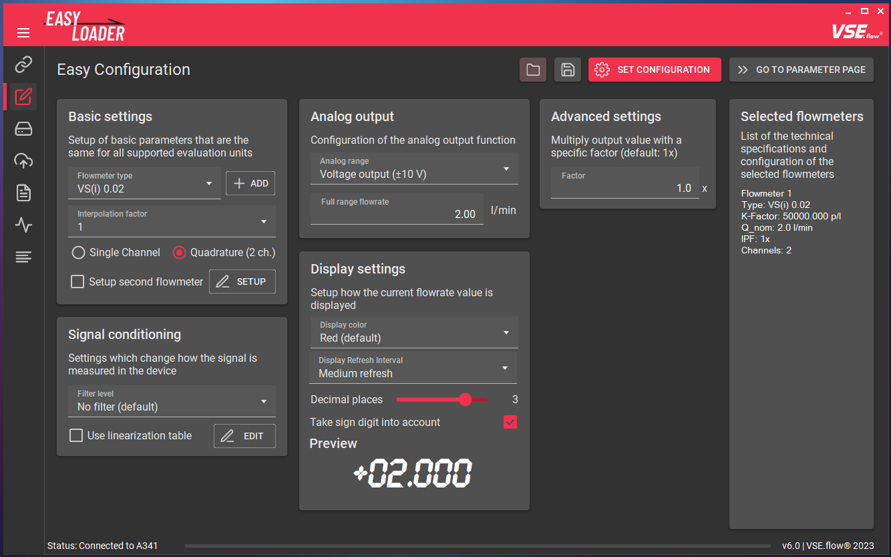
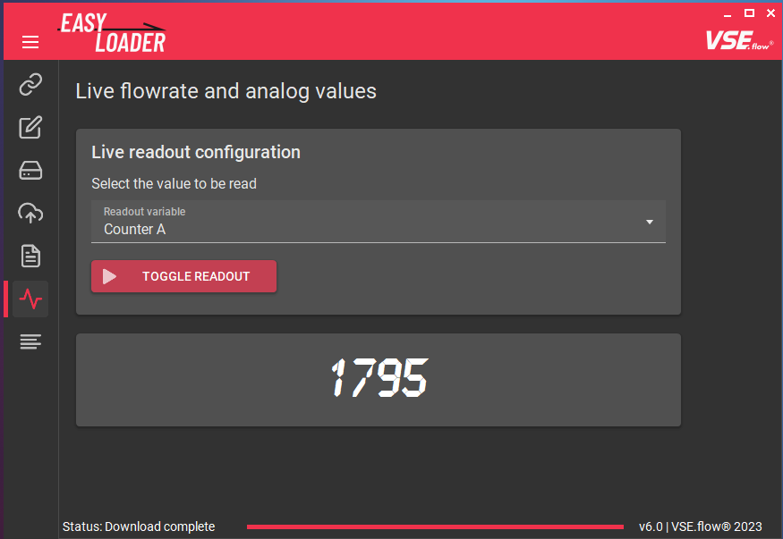

# Basic configuration


## :octicons-tab-external-16: Program Overview

This chapter shows an overview of all available features ordered by the pages in the tab drawer. Every feature will be described to explain its specific function. The program consists of multiple tab pages that can be switched using the tab icons on the left menu. By clicking on the _"hamburger menu button"_ the icon labels are expanded.


### :octicons-link-16: Connection Setup

The connection shows all available COM-ports on the system. To connect to a device, select the corresponding list item. The current connection status can be observed in the bottom toolstrip. Also connection diagrams and user manuals can be accessed using the corresponding buttons. 


### :material-application-edit-outline: Easy Configuration

In this tab, the main device configuration is being made. An example configuration will be described in the [following chapter](#configuration-workflow). By filling in the input fields, EasyLoader can calculate the neccessary device registers for the desired device functionality. Each configuration option will later be explained in-depth in the ["Features"](3features.md#easy-configuration) section of this documentation.



### :fontawesome-regular-hard-drive: Device Parameter Editor

The **Device Parameter Editor** is used to transfer the calculated register values or edit registers manually. The changes will be made offline and can then be transmitted to the device using the ```UPLOAD``` button in one go. You may also choose to use the ```Send on edit``` checkbox to immediately send register changes after editing a field. The ```Permanent storage``` checkbox applies an "EEPROM STORE" command immediately after sending all values to ensure data persistance after a power cycle. The full feature description can be found [here](3features.md#device-parameter-editor).


### :material-cloud-upload-outline: Up- & Download

The **Up- & Download tab** allows you to upload a previously saved or transmitted parameter file (*.xml type) and create such a file that contains all registers of a connected device. By choosing a file, you can also preview the file contents before uploading. The functionality is further explained [here](3features.md#xml-up---download).


### :material-file-eye-outline: XML Preview

To view the file contents of a parameter file, the **XML Preview tab** can be used. On the right panel, additional information is shown that has been saved during the download process like the name of the file creator and a custom comment. 


### :octicons-pulse-16: Live Readout

To check the parametrization and watch the current measurement value, the ```Live Readout tab``` was added. This is especially helpful, if you are configuring a device without display, like the FU210. Different display options are selectable, ranging from the current display values over raw frequency values to the analog output voltage.



### :material-text-long: About EasyLoader

On the about page, the current version of the EasyLoader is displayed. You also get access to the previously accepted disclaimer, this documentation and an option to reset all user settings and cache data of this software (contains custom flowmeter definitions, cached manuals, cached documentation, information about whether you accepted the disclaimer).


## Configuration Workflow

The process of configuring a device with the EasyLoader is very simple. The workflow is shown in the following diagram.


### :material-connection: Connecting a device

To communicate with the measuring instrument a connection over the serial port must be established. Depending on the device and whether it is mounted in a table housing, you need to connect them to the pc using different methods. 

Refer to [the next chapter](3features.md#connection-setup) for more information about the connection process. If you dont know, how to connect the device, you can use the integrated [connection diagrams](3features.md#connection-setup).

After starting the EasyLoader the connection tab is shown. Select the COM port to which the device is connected and the connection process should be initiated. The device preview will change according to the detected device type.

Click on the ```Configure Device``` button or select the next tab in the menu bar to continue.

### :fontawesome-solid-gear: Example configuration

In the **Easy Configuration** tab the connected device can be configured using only a few selections. The following example configuration will only go over the selections briefly. For a more in-depth description, move to the [next chapter](3features.md). Depending on the connected device the available input fields will vary:

- Basic settings
- Signal conditioning
- Analog output
- Advanced settings
- Display settings (only on **A341** and **A350**)

For our example configuration we have the following devices on hand:

- [x] A350-28 in a table housing
- [x] Flowmeter VSI 1/32 GPO12V-42R11

    :material-arrow-right-bold: IPF = 32

    :material-arrow-right-bold: 2-channel preamplifier

    :material-arrow-right-bold: Without calibration protocol


The fluid process is highly dynamic and needs a fast measurement reaction time with no filtering but a stable display value. The display unit is $\frac{\textrm{l}}{\textrm{min}}$ and should display with 4 decimal places. The used flow range is limited to $60 \frac{\textrm{l}}{\textrm{min}}$, the analog output's fullscale value should therefore be set to this value. The 4-20 mA output option should be used.  

- [x] No filter, medium display update
- [x] 4 decimal places
- [x] Unit: $\frac{\textrm{l}}{\textrm{min}}$
- [x] Analog output: 4-20 mA current output
- [x] $Q_{fullrange} = 60 \frac{\textrm{l}}{\textrm{min}}$

Using this data the input fields can now be completely filled:


After completion of the configuration, the corresponding device register values have to be calculated and uploaded into the device. In order to do this, click on the ```UPLOAD CONFIG``` button. 

<!--
and proceed to the next tab using the ```GO TO PARAMETER PAGE``` button. 

  

### :material-progress-upload: Register upload

In the **Parameter editor** tab you will see the calculated register values. All changed registers are marked with a filled arrow icon (:material-arrow-up-box:). To finally upload the parameters into the device, use the ```UPLOAD``` button to initiate the transfer. The transfer should only take a few seconds. After uploading the parametrization is instantly active on the connected device and the display and analog output should be outputting the right values. 

  

-->

Using this technique, by default, all the parameters are saved in the device's EEPROM and loaded on every power-on. 

### :material-test-tube: Test

The configuration is now active, you can try it out by connecting a flowmeter and TestBox TB2 to the device and input a known frequency. If the display/analog port outputs the expected flowrate, the configuration was successful.

### :material-lan-disconnect: Disconnect

You may now disconnect the device. The software automatically recognizes a disconnect after a few seconds.

