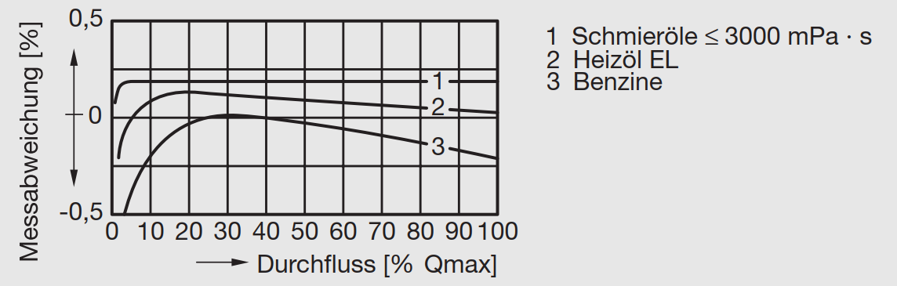
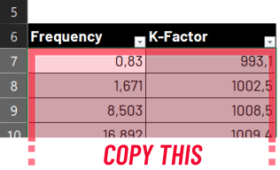
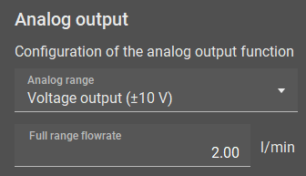

# Features

## :material-connection: Connection Setup


### Connecting the device to the computer

Depending on the device and whether it is mounted in a table housing, you need to connect them to the pc using different methods. 
You can use the integrated device connection diagrams of the EasyLoader without even connecting a device using the ```CONNECTION DIAGRAM``` button in the connected device card (see following image).

**Option** | **Connection method**
--- | ---
**A341/A350** (device only) | Devices RS232 terminal :material-arrow-right-bold: Crossed wires :material-arrow-right-bold: DSUB9 connector :material-arrow-right-bold: RS232-USB Adapter :material-arrow-right-bold: PC
**A341/A350** (table housing) | Housing DSUB9 connector :material-arrow-right-bold: RS232-USB Adapter :material-arrow-right-bold: PC<br>***OR***<br>Housing DSUB9 connector :material-arrow-right-bold: 1:1 RS232 extension cable :material-arrow-right-bold: RS232-USB Adapter :material-arrow-right-bold: PC
**FU210** (via miniUSB) | Devices miniUSB terminal :material-arrow-right-bold: USB-A to USB-Mini-B cable :material-arrow-right-bold: PC
**FU210** (via RS232) | Devices RS232 terminal :material-arrow-right-bold: Crossed wires :material-arrow-right-bold: DSUB9 connector :material-arrow-right-bold: RS232-USB Adapter :material-arrow-right-bold: PC

{width=650}

### Establishing a connection
To communicate with the measuring instrument a connection over the serial port must be established. 

After starting the EasyLoader the connection tab is shown. All available COM-Ports (except ports from Bluetooth devices) on the system are automatically shown. Using the ```REFRESH``` button, a new port scan will be initiated and the list gets refreshed. By clicking on a specific port in the list, a port scan and the connection process is initiated. The device preview will change according to the detected device type. The preview will show an image and a short description of the connected device. The buttons below can be used to open the user manual or the specific connection diagram. 

To disconnect a device, click on the large button saying ```CONNECTED``` or close the application. Also disconnecting the RS232 or USB cable will terminate the connection after a few seconds. 


### Firmware version
Futhermore, the firmware version can be read out using the corresponding button to check, whether your device is tested and compatible with the current version of EasyLoader. Using other/older firmware version may also work but correct functionality is not guaranteed. If any major problem occur, try using an older version of VSE EasyLoader (:material-arrow-right-bold: contact sales or download from [:material-link: vse-flow.com](https://www.vse-flow.com/en/downloads.html)).

The current software versions of the devices are listed in the following table:

**Device**  :fontawesome-brands-usb: | **Software version (as of 23.01.2023)**  :fontawesome-solid-microchip:
--- | ---
**A341** | 2
**A350** | F
**FU210** | C
<!---
**FU252** | C
-->

## :material-application-edit-outline:  Easy Configuration


!!! info inline end "Only if connected"

    Switching to a tab other than the **Connection Setup**, **XML Preview** and **About** tab is not possible if the connection has not yet been established.

### Basic settings


Start by selecting the flowmeter that is connected to the device. This information is important so the software knows the right nominal K-Factor value of the flowmeter for the register calculations. You can choose among all flowmeters that are distributed by VSE. If you want to add other flowmeters or encoder devices, you can create a custom flowmeter definition using the ```ADD``` button (futher explained [here](#custom-flowmeter-definitions)). 

Next, input the interpolation factor that has been set in the flowmeter's preamplifier. Usually this information is written on the flowmeters type plate, e.g. _VSI 0,2/<ins>32</ins> GPO12V-42R11/X_ :material-arrow-right-bold: IPF = 32.

By default, the signal evaluation is set to ```Quadrature (2 ch.)``` which will result in the best measuring resolution, response time and will also enable direction detection. Depending on the flowmeter, you may have to choose the ```Single Channel``` evaluation type, e.g. for the VHM, VS-HT or EF series. Also check the connection so that the _active_ wire (either white or black, check datasheet) is connected to the input A of the device. Please note that direction detection will not work, if using the single channel evaluation method.

!!! info "Input configuration"

    Depending on whether you have an **Push-Pull**, **NPN** or **PNP** output on your flowmeter you may also have to change the input configuration register of your flowmeter manually. By default the option is set to **PNP** and works with most flowmeters. Please refer to the user manual for an explaination how to do this.

The software will also check, if the combination of flowmeter and interpolation factor exceeds the recommended maximum output frequency of the flowmeter of 125 kHz. Consider lowering the IPF of the preamplifier if a warning pops-up.

#### Custom flowmeter definitions


##### Adding custom flowmeter presets

{width="350"}

{width="450"}

By clicking on the ```ADD``` button, a new flowmeter definition can be added, if the used flowmeter does not appear in the list. You can specify a name, the nominal/maximum flowrate which will be used for the fullscale analog output, the K-Factor and a list of selectable interpolation factors. The list of IPFs has to be a comma seperated list. There can not be two flowmeter definitions with the same name. If this is the case the preset will not be saved. 

By importing a configuration into the EasyLoader (which will be described in [this chapter](#configuration-file-importexport)) the included flowmeter preset will be imported and permanently saved, if it is missing in the current list.

By default, the currently active preset will be copied and filled as template values for a new flowmeter definition. This can especially be useful if you have an older flowmeter on hand that has other interpolation factors. With this feature you can then easily create a definition for the older preamplifier version.  

##### Managing and removing custom flowmeter presets

The ```Flowmeter preset editor``` can be opened using the **Gear** icon (:octicons-gear-16:) next to the `ADD` button.

Here you can view all custom flowmeters that you added. There is also an option to remove the preset. In-place editing is _not_ supported. To do that, just recreate the preset.


#### Setup second flowmeter

!!! warning "Only for A341"

    This feature is only available for the A341 because it is the only device with two full encoder interfaces. The evaluation of two encoders is certainly also possible on the other devices, but with disadvantages like missing _quadrature channel evaluation_ / _direction detection_ support.

With the A341 the EasyLoader supports setting up a second flowmeter. When checked, the same options as before have to be set for the other flowmeter. At the bottom of the new dialog the ```Calculation mode``` has to specified. This setting will say how the two measurement values will be handled and displayed on the device. You can choose between showing only either flowmeter A or B and math functions like A+B, A-B and A/B. 


### Signal conditioning


#### Filters

!!! tip inline end "Tip: Use display refresh"

    To create a more stable reading but also want a fast analog output, consider to leave the ```Filter level``` low/off and set the ```Display Refresh Interval``` higher.

Here you can set up filters and linearization functions for the measured frequencies. By default no filtering is used to ensure the fastest display and analog output reaction. If there is very unsteady flow, the filter can be used to smooth out the vibrations and create a stable reading. You can choose between averaging and exponential filters. 

 **Moving average filter**

`

**Exponential filter**


_(The shown images show the analog output of an A350 with a sampling time of 50 ms and different filter settings)_

!!! warning "Display refresh $\neq$ Analog output"
        For display-devices, the analog output refresh time works independently of the configured display refresh interval. Therefore a slower display refresh time can be set while still having a fast analog output. The filter settings on the other hand will be used for both the display and the analog output.

??? question "I need more filtering - the filter levels are not enough!"
    The ```SAMPLING TIME``` register defines the interval at which the filter is feeded with new values. This directly influences the filter dynamics. By default the ```SAMPLING TIME``` is set to the lowest possible value in order to achieve an fast output reaction. Therefore the effects of the configured filter level may not be enough for the application. To create a bigger filter influence, the ```SAMPLING TIME``` must be increased.

#### Linearization

Most flowmeters output a pulse signal or frequency that corresponds to the current flowrate ($f\sim Q$). For displacement-type flowmeters, this relation is not perfectly linear due to manufacturing tolerances and the effects of fluid viscosity. This leads to a K-Factor that is not constant. Especially in the lower flow range, the K-Factor will be certainly lower. Because of this, flowmeters requiring a high accurancy over the whole flowrange will be calibrated. If you have a calibration certificate on hand, you can input the values into the EasyLoader to let the device internally calculate the correct flowrate based on the flowmeter's specific Frequency-to-K-Factor table.

<figure markdown>
  
  <figcaption>Typical error curve of a displacement-type flowmeter <br>[Source: ABB Measurement & Analytics: Industrielle Durchfluss-Messtechnik - Grundlagen und Praxis (2017), p. 32]</figcaption>
</figure>

!!! info inline end "Dot (.) as decimal seperator"

    Take note that the program uses the dot as a decimal seperator and no thousands seperator. If you use a comma (,) it will be replaced by the dot (.) while entering or pasting data.

Using the **Linearization Table Editor** the linearization data can be entered. You can either manually type in all the data or use the copy and paste functionality. The standard way of doing so is preparing your calibration data in an Excel sheet in two columns and then copying (```CTRL + C```) and pasting (```CTRL + V```) the data into the linearization window. Be sure to exclude column headers while copying. 


 
 The two data columns that you need are:

- Flowmeter output frequency $f$ [Hz]
- Flowmeter K-Factor $K_{fact}$ [pulses/l]

The third column - _the flowrate_ $Q$ - will be calculated automatically.

 

Use the ```SORT AND ALIGN``` button to _bottom align_ and sort randomly input data ascending. This function will also be automatically performed by clicking the ```APPLY SETTINGS``` button. By clicking the ```CLEAR``` button, the whole linearization table will be replaced by zero values to start from scratch.

Confirm the input linearization points by clicking ```APPLY SETTINGS```. Make sure that the corresponding checkbox is active in the **Signal conditioning** card if you want to transmit the calibration points into the device.

!!! info "First linearization point"

    You don't need to add a first linearization point with zero values (0 | 0). It will be automatically added invisibly in the background!

??? question "FAQ: Why is there a less than advertised number of linearization points available?<br>FAQ: Why does it throw the error: '_too many columns_'?" 

    This is due to the fact that the first linearization register value always needs to be zero and the last one always needs to be the maximum value possible. This prevents the display value getting stuck if frequencies over the maximum linearized frequency occur, e.g. for detecting overload conditions. The other input fields that are shown can be completely filled with values. Therefore the number of available calibration points shrinks by two.

    If you have a calibration certificate on hand with more than the allowed number of points, the best way to handle this is to skip some linearization points where the change of the $K_{fact}$ value is the least or where the error curve is mostly linear. 

### Analog output



On the **Analog Output** card you can select the analog output port configuration. On all devices you can choose either a voltage or a current output. 
The options are:

??? question inline end "FAQ: Why is my analog output zero even though flow is present?"

    1. Check if your flow direction is negative. Try changing the ```direction``` register, swapping A and B wires, rotating the flowmeter or flipping the switch on the preamp.
    2. Check if you have selected ```Quadrature (2 ch.)``` even though your flowmeter only has one channel.

- Voltage output (+/- 10 V)
- Voltage output (0 - 10 V)
- Current output (0 - 20 mA)
- Current output (4 - 20 mA)

!!! danger inline end "Important for maximum measurement accuracy/resolution" 
    To keep signal noise on the analog output to a minimum, it is always recommended to choose the lowest fullscale flowrate that still fits your application (include some flow overload detection margin). This will ensure that you are making the most of the 16-bit analog output of your device. 

Futhermore you have to specify the flowrate that corresponds to the analog fullscale value. For example: A _VSI 1_ flowmeter has a nominal maximum flowrate of $Q_{nom}=80 \frac{\textrm{l} }{\textrm{min} }$. If you for example have a high fluid viscosity and only use the flowmeter until half its nominal range, you can increase the effective analog resolution by using a lower fullscale flowrate of $Q_{nom}=40 \frac{\textrm{l} }{\textrm{min} }$.

If linearization is used, this value will still be the reference value for the fullscale flowrate. The last linearization point should still be approximately in the range of this value.

!!! info "Hint: Display value $\sim$ Analog value"
    For the A341 and A350 the analog voltage/current is always proportional to the shown display value.


### Display settings


!!! tip inline end "Tip: Conditional display colors with the A350"

    If you're using the A350, you can configure up to four predefined values that change the color of the display, e.g. to show that the flowrate exceeds the limits of the application (change display: _green_ :material-arrow-right-bold: _red_). With all devices you can also use these flow/volume preset values to trigger digital outputs.

The **Display settings** define, how the measured flowrate is displayed on the display devices A341 and A350. 

For the A350 you can choose between three ```display color options``` :material-arrow-right-bold: _red_, _green_ and _yellow_. For the A341, the digits will always be coloured red.

The ```display refresh interval``` can be used to adjust how fast the display should update its value. This setting has no influence on the dynamics of the analog output. To make manual readouts it is recommended to choose a slower display refresh time and using the filter function of the [Signal conditioning](#signal-conditioning) card. 

The slider ```decimal places``` sets the number of decimal places shown on the display, taking into account the maximum number of displayable digits of the device. If negative flowrates can also occur in the application, the ```sign digit``` should also be included to reserve a digit for it.

!!! danger "Important: Choose large number of decimal places" 
    
    Generally, the number of digits should be as large as possible to minimize the effects of internal rounding errors in the device. Especially if using the linearization function, more decimal places lead to a more precise measurement.

### Advanced settings

Under the **Advanced settings** you can configure a custom factor that is being multiplied with the calculated display value, analog end value and all linearization values. 

The base unit for this is $\frac{\textrm{l}}{\textrm{min}}$. To for example show the display value in another unit, simply use the conversion factor from $\frac{\textrm{l} }{\textrm{min}}$ to your custom unit. To find a factor, you can use the calculator in the [footnotes](#footnotes). Here are some examples:

**Target unit** | **Conversion factor**[^1]
--- | ---
$\frac{\textrm{ml}}{\textrm{min}} = \frac{\textrm{cm}^3}{\textrm{min}}$ :material-arrow-right-bold: Millilitres per minute | 1000.0
$\frac{\textrm{l}}{\textrm{h}}$ :material-arrow-right-bold: Litres per hour | 60.0
$\frac{\textrm{l}}{\textrm{s}}$ :material-arrow-right-bold: Litres per second | $\frac{1}{60} \approx$  0.0166666667
$\textrm{gpm}$ :material-arrow-right-bold: Gallon (fluid, US) per minute | 0.26417205235815   
$\frac{\textrm{in}^3}{\textrm{min}}$ :material-arrow-right-bold: Cubic inch per minute | 61.023744094732

### Selected flowmeters

{width=150}

The **Selected flowmeters** card shows information about the technical specification of the selected flowmeters like the nominal K-Factor and maximum (nominal) flowrate. Also the selected values for IPF and channel count are added. Changes of the custom fullscale flowrate are not shown in the card.

### Configuration file import/export


Using the ```IMPORT``` and ```EXPORT``` buttons in the top row of the **Easy configuration** tab you can save and restore so called ```*.easyConf``` presets. They contain all selected/configured values of the **Easy configurator**, but ***NOT*** settings that are currently saved on the device. You can use this filetype for most use cases.

!!! warning "Attention: .easyConf-file :material-not-equal-variant: .xml-file"
    To download the settings (= _register values_) stored on the device, use the [XML Downloader](#xml-up---download). This will generate an .xml-file that contains all device registers. If you for example want to email your exact device configuration, you should generally perform a device download. This filetype can also be opened in the **user software OS 10.0**[^2]. 

!!! question "FAQ: Why should I use the ```*.easyConf``` files if I can use the ```.xml``` download function?" 
    The ```*.xml``` files only contain the raw register values. The new ```*.easyConf``` filetype contains all configured settings including the original linearization values and the actual flowmeter name/values. This approach leaves more room for later editing of settings. 
    On the other hand, the ```*.easyConf``` file only contains the selectable settings. If you want to save the complete device state (with limit values, user inputs, etc.), you should rather use the ```*.xml``` filetype.

If the ```*.easyConf```-file contains a [custom flowmeter definition](#custom-flowmeter-definitions) it will be imported and permanently (_until a program settings reset_) added to your list of flowmeter definitions if it doesn't exist.

### Applying the configuration

{align=right}

After completing the configuration, the corresponding device register values have to be calculated and uploaded into the device. In order to do this, click on the ```UPLOAD CONFIG``` button. 

By default the ```UPLOAD CONFIG``` performs the register calculation, uploads the changed registers, applies the changes and performs an "EEPROM Store" command on the device to permanently save the settings.

!!! tip "Tip: Alternative upload procedure (advanced)"

    {align=right}

    If you want more control about what and how you upload the changed registers to the device, you can change the ```UPLOAD CONFIG``` to ```CALC REGISTERS``` to only calculate the register values. You can then proceed to the Parameter Editor using the ```GO TO PARAMETER PAGE``` button and review the changes before uploading them using the ```UPLOAD``` button.

    In order to do this, right-click on the ```UPLOAD CONFIG``` button and select ```Change button to "CALC REGISTERS".

    **Advantages:**

    - :fontawesome-solid-hard-drive:  One advantage of this feature is, that you can decide yourself if you want the parameters stored only temporarily instead of permanently by unchecking ```Permanent storage``` in the Parameter Editor before uploading. 
    
    - :material-mouse:  Another is, that you can undo/deselect individual changed registers by right- or middle-mouse-clicking them. 

<!--
```SET CONFIGURATION``` button and proceed to the next tab using the ```GO TO PARAMETER PAGE``` button. 

{align=right}

From there you can then click on the ```UPLOAD``` button to transfer, activate and permanently store the settings onto the connected device. If you ***do not*** want to permanently store the data (= apply only for this power-on cycle) then you have to deselect the ```Permanent storage``` checkbox in the parameter editor options before clicking ```UPLOAD```.


!!! tip "Tip: Faster device parametrization"
    {align=right}
    If you want to skip the _>```GO TO PARAMETER PAGE``` and then press ```UPLOAD```_<-step you can reconfigure the ```SET CONFIGURATION``` button by right clicking on it and switching its functionality to ```UPLOAD CONFIG NOW```. With this enabled, the program will calculate the registers and instantly transmit the values over to the device. Make sure to have checked the ```Permanent storage``` option in the [device parameter editor](#device-parameter-editor) if this configuration should be permanent.

     

-->

## Device Parameter Editor


After calculating the device's register values using the **Easy configuration** tab the **Device Parameter Editor** has to be used to transfer the changes register values to the device. The registers are displayed in a table view that contains the following columns:

- **Category**: The general category, that the parameter belongs to. 
- **Name**: The name of the device register. This name matches the one used in the corresponding user manual.
- **Raw Value**: The raw register value to be edited. All other colums are read-only.
- **Actual Value**: Preview the effective device value with decimal places added.
- **Status**: Shows if the displayed raw value differs from the device value. If the icon is ***filled*** the parameter was changed and is pending for upload.
- **Min / Max**: The value range of the corresponding register value.
- **Register**: The internal register code used to identify the register. (Hint: The relation between _Register name_ and _Code_ can change between firmware revisions.)

{align=right}

There is a search/filter function on top to quickly find a specific device register. It works independent of the ```Show basic/all settings``` option.

There are three settings that can be changed in the **device parameter editor**. These program settings are saved on program exit and will be restored each time the EasyLoader is reopened. 

- **Send on edit**: Instantly sends a register change after a manual edit. This feature is useful if you want to play around with a value / fine adjust it.
- **Permanent storage**: This sends an ```EEPROM STORE``` command immediately after changing a register value
- **Show basic/all settings**: Only show the most relevant registers (**default**). Uncheck to see all available device registers.

!!! warning "Caution while using the _Send on edit_-feature"
    Using the ```Send on edit```-feature in conjunction with the ```Permanent storage``` option may wear out the device's EEPROM faster if many consecutive parameter adjustments are being made. You should rather disable the ```Permanent storage``` option while playing with a value and commit the final state after all settings are fixed with a click on the ```UPLOAD``` button with the ```Permanent storage``` option enabled. Most EEPROMs are made for ~100 000 write cycles.

In the top right corner you will find two buttons to initiate transfer actions:

{align=right}

- **REFRESH**: Discards all currently changed values and downloads all register values from the device. 
- **UPLOAD**: Uploads all changed register values into the devices and verifies each uploaded register. 

!!! tip "Tip: Restore original value"
    If you accidently changed a register value and want the original value (= the value that was last downloaded from the device) back, you can do so by right-clicking on the ```Raw value``` column of the corresponding register and selecting ```Restore original value```. An even quicker way to do so is by clicking on the register row with the middle mouse button.

### Factory reset
If the device does not behave like expected, you can try to do a factory reset. This will wipe all settings on the device and restore the default values. To do this, click on the ```RESTORE FACTORY DEFAULTS``` button in the bottom bar.


## XML Up- & Download


!!! info inline end "OS 10.0 compatible"
    The generated ```*.xml```-files can also be opened in older version of the EasyLoader or the **user software OS 10.0**[^2]

In the **Parameter set management** tab you can up- and download the complete device configuration from/to the previously described ```*.xml```-files.
This feature is useful if you want to make a device backup or you want to email your device configuration.

To initiate a download, simply add a useful file comment (so the person opening your file knows about its contents) and hit the ```START DOWNLOAD``` button. The process starts and should finish in a few seconds as soon as the bottom progress bar is at 100%. The downloaded file can then be previewed using the internal [XML Viewer](2basics.md#xml-preview).

An upload can be started by choosing a compatible ```*.xml``` file that matches the connected device type. If the devices do not match, the file can not be used for the upload process. To start the upload process, hit the ```START UPLOAD``` button.

## Footnotes

[^1]: Source:  [:material-link: convert-measurement-units.com](https://www.convert-measurement-units.com/conversion-calculator.php?type=volumenstrom)
[^2]: Source:  [:material-link: vse-flow.com/downloads/software](https://www.vse-flow.com/en/downloads.html?scrollTo=software)
