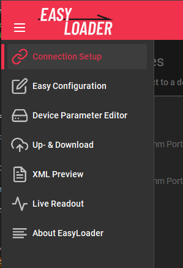
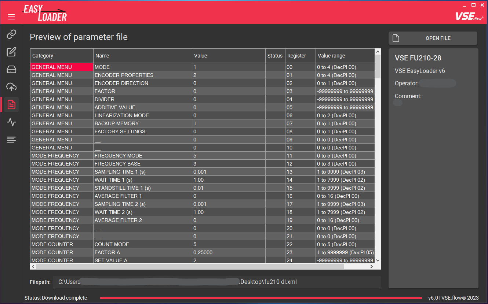

# Basic configuration


## :octicons-tab-external-16: Programmübersicht {id="program-overview"}

Dieses Kapitel gibt einen Überblick über alle verfügbaren Funktionen, geordnet nach den Seiten der Registerkarte. Jedes Feature wird beschrieben, um seine spezifische Funktion zu erklären. Das Programm besteht aus mehreren Registerkarten, die über die Registerkarten-Symbole im linken Menü umgeschaltet werden können. Durch Klicken auf den _"Hamburger-Menü-Button"_ werden die Symbolbeschriftungen aufgeklappt.



### :octicons-link-16: Connection Setup {id="connection-setup"}

Die Verbindung zeigt alle auf dem System verfügbaren COM-Ports an. Um eine Verbindung zu einem Gerät herzustellen, wählen Sie das entsprechende Listenelement aus. Der aktuelle Verbindungsstatus kann in der unteren Symbolleiste eingesehen werden. Über die entsprechenden Schaltflächen kann auch auf Verbindungsdiagramme und Benutzerhandbücher zugegriffen werden. 


### :material-application-edit-outline: Easy Configuration {id="easy-configuration"}

Auf dieser Registerkarte wird die Hauptkonfiguration des Geräts vorgenommen. Eine Beispielkonfiguration wird im [folgenden Kapitel](#configuration-workflow) beschrieben. Durch Ausfüllen der Eingabefelder kann EasyLoader die notwendigen Geräteregister für die gewünschte Gerätefunktionalität berechnen. Jede Konfigurationsoption wird später im Abschnitt ["Features"](3features.md#easy-configuration) dieser Dokumentation ausführlich erläutert.


### :fontawesome-regular-hard-drive: Device Parameter Editor {id="device-parameter-editor"}
Der **Geräteparameter-Editor** dient dazu, die berechneten Registerwerte zu übertragen oder Register manuell zu bearbeiten. Die Änderungen werden offline vorgenommen und können dann mit dem Button `UPLOAD` in einem Rutsch an das Gerät übertragen werden. Sie können auch das Kontrollkästchen `Send on edit` verwenden, um die Registeränderungen sofort nach der Bearbeitung eines Feldes zu senden. Die `Permanent storage` Checkbox wendet einen "EEPROM STORE" Befehl sofort nach dem Senden aller Werte an, um die Datenbeständigkeit nach einem Stromausfall sicherzustellen. Die vollständige Funktionsbeschreibung finden Sie [hier](3features.md#device-parameter-editor).


### :material-cloud-upload-outline: Up- & Download

Auf der Registerkarte **Up- & Download** können Sie eine zuvor gespeicherte oder übertragene Parameterdatei (Typ *.xml) hochladen und eine solche Datei erstellen, die alle Register eines angeschlossenen Geräts enthält. Wenn Sie eine Datei auswählen, können Sie auch eine Vorschau des Dateiinhalts vor dem Hochladen anzeigen. Die Funktionalität wird [hier](3features.md#xml-up---download) weiter erläutert.


### :material-file-eye-outline: XML Preview

Zur Anzeige des Dateiinhalts einer Parameterdatei kann die Registerkarte **XML-Vorschau** verwendet werden. Auf der rechten Seite werden zusätzliche Informationen angezeigt, die während des Download-Prozesses gespeichert wurden, wie der Name des Dateierstellers und ein benutzerdefinierter Kommentar. 



### :octicons-pulse-16: Live Readout

Um die Parametrierung zu überprüfen und den aktuellen Messwert zu beobachten, wurde die Registerkarte `Live Readout` hinzugefügt. Dies ist besonders hilfreich, wenn Sie ein Gerät ohne Display konfigurieren, wie z.B. den FU210. Es sind verschiedene Anzeigeoptionen wählbar, die von den aktuellen Anzeigewerten über Frequenzrohwerte bis hin zur analogen Ausgangsspannung reichen.


### :material-text-long: About EasyLoader

Auf der Über-Seite wird die aktuelle Version des EasyLoaders angezeigt. Sie erhalten auch Zugriff auf den zuvor akzeptierten Haftungsausschluss, diese Dokumentation und eine Option zum Zurücksetzen aller Benutzereinstellungen und Cache-Daten dieser Software (enthält benutzerdefinierte Volumensensor-Definitionen, zwischengespeicherte Handbücher, zwischengespeicherte Dokumentation, Informationen darüber, ob Sie den Haftungsausschluss akzeptiert haben).


## Konfigurationsablauf {id="configuration-workflow"}

Der Prozess der Konfiguration eines Geräts mit dem EasyLoader ist sehr einfach. Der Arbeitsablauf ist im folgenden Diagramm dargestellt.


### :material-connection: Anschluss eines Gerätes {id="connecting-a-device"}

Um mit dem Messgerät zu kommunizieren, muss eine Verbindung über die serielle Schnittstelle hergestellt werden. Je nachdem, um welches Gerät es sich handelt und ob es in einem Tischgehäuse montiert ist, müssen Sie es auf unterschiedliche Weise mit dem PC verbinden. 

Im [nächsten Kapitel](3features.md#connection-setup) finden Sie weitere Informationen über den Verbindungsvorgang. Wenn Sie nicht wissen, wie Sie das Gerät anschließen, können Sie die integrierten [Anschlussdiagramme](3features.md#connection-setup) verwenden.

Nach dem Start des EasyLoaders wird die Registerkarte Verbindung angezeigt. Wählen Sie den COM-Port aus, an dem das Gerät angeschlossen ist und der Verbindungsprozess sollte gestartet werden. Die Gerätevorschau ändert sich je nach erkanntem Gerätetyp.

Klicken Sie auf die Schaltfläche ``Gerät konfigurieren`` oder wählen Sie die nächste Registerkarte in der Menüleiste, um fortzufahren.

### :fontawesome-solid-gear: Beispielkonfiguration {id="example-configuration"}

Auf der Registerkarte **Einfache Konfiguration** kann das angeschlossene Gerät mit nur wenigen Auswahlen konfiguriert werden. Die folgende Beispielkonfiguration geht nur kurz auf die Auswahlmöglichkeiten ein. Eine ausführlichere Beschreibung finden Sie im [nächsten Kapitel](3features.md). Je nach angeschlossenem Gerät variieren die verfügbaren Eingabefelder:

- Grundeinstellungen
- Signalaufbereitung
- Analoger Ausgang
- Erweiterte Einstellungen
- Displayeinstellungen (nur bei **A341** und **A350**)

Für unsere Beispielkonfiguration haben wir die folgenden Geräte zur Verfügung:

- [x] A350-28 in einem Tischgehäuse
- [x] Volumensensor VSI 1/32 GPO12V-42R11

    :material-arrow-right-bold: IPF = 32

    :material-arrow-right-bold: 2-Kanal Vorverstärker

    :material-arrow-right-bold: Ohne Kalibrierungsprotokoll

Der Prozess der Durchflussanwendung ist hochdynamisch und erfordert eine schnelle Messreaktionszeit ohne Filterung, aber mit einem stabilen Anzeigewert. Die Anzeigeeinheit ist $\frac{\textrm{l}}{\textrm{min}}$ und sollte mit 4 Dezimalstellen angezeigt werden. Der verwendete Durchflussbereich ist auf $60 \frac{\textrm{l}}{\textrm{min}}$ begrenzt, der Vollausschlags-Wert des Analogausgangs sollte daher auf diesen Wert eingestellt werden. Die Option 4-20 mA-Ausgang sollte verwendet werden.  

- [x] Kein Filter, mittlere Anzeigeaktualisierung
- [x] 4 Dezimalstellen
- [x] Einheit: $\frac{\textrm{l}}{\textrm{min}}$
- [x] Analoger Ausgang: 4-20 mA Stromausgang
- [x] $Q_{Vollausschlag} = 60 \frac{\textrm{l}}{\textrm{min}}$

Mit diesen Daten können die Eingabefelder nun vollständig ausgefüllt werden:


Nach Abschluss der Konfiguration müssen die entsprechenden Registerwerte des Gerätes berechnet und in das Gerät hochgeladen werden. Klicken Sie dazu auf die Schaltfläche `UPLOAD CONFIG`. 

<!--
and proceed to the next tab using the ```GO TO PARAMETER PAGE``` button. 

  

### :material-progress-upload: Register upload

In the **Parameter editor** tab you will see the calculated register values. All changed registers are marked with a filled arrow icon (:material-arrow-up-box:). To finally upload the parameters into the device, use the ```UPLOAD``` button to initiate the transfer. The transfer should only take a few seconds. After uploading the parametrization is instantly active on the connected device and the display and analog output should be outputting the right values. 

  

-->
Mit dieser Technik werden standardmäßig alle Parameter im EEPROM des Geräts gespeichert und bei jedem Einschalten geladen. 

### :material-test-tube: Test

Die Konfiguration ist nun aktiv, Sie können sie ausprobieren, indem Sie einen Volumensensor und die TestBox TB2 an das Gerät anschließen und eine bekannte Frequenz eingeben. Wenn die Anzeige/Analogschnittstelle die erwartete Durchflussrate ausgibt, war die Konfiguration erfolgreich.

### :material-lan-disconnect: Trennen der Verbindung

Sie können nun die Verbindung zum Gerät trennen. Die Software erkennt das Trennen der Verbindung automatisch nach ein paar Sekunden.
