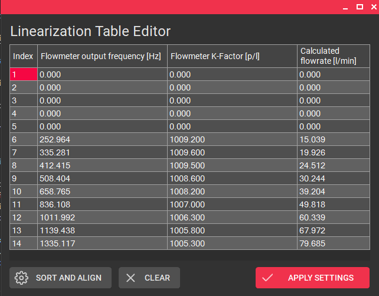
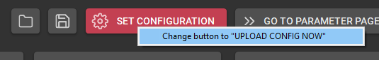

# Features

## :material-connection: Verbindungseinstellungen {id="connection-setup"}


### Anschließen des Geräts an den Computer {id="connectiing-the-device-to-the-computer"}
Je nach Gerät und je nachdem, ob es in einem Tischgehäuse montiert ist, müssen Sie es auf unterschiedliche Weise mit dem PC verbinden. 
Sie können die integrierten Geräteanschlussdiagramme des EasyLoaders nutzen, ohne ein Gerät anzuschließen, indem Sie die Schaltfläche `CONNECTION DIAGRAM` in der angeschlossenen Gerätekarte verwenden (siehe folgendes Bild).

**Option** | **Verbindungsmethode**
--- | ---
**A341/A350** (nur Gerät) | Geräte RS232-Anschluss :material-arrow-right-bold: Crossed wires :material-arrow-right-bold: DSUB9 connector :material-arrow-right-bold: RS232-USB Adapter :material-arrow-right-bold: PC
**A341/A350** (Tischgehäuse) | Gehäuse DSUB9 Verbinder :material-arrow-right-bold: RS232-USB Adapter :material-arrow-right-bold: PC<br>***OR***<br>Gehäuse DSUB9 Verbinder :material-arrow-right-bold: 1:1 RS232 extension cable :material-arrow-right-bold: RS232-USB Adapter :material-arrow-right-bold: PC
**FU210** (über miniUSB) | Geräte miniUSB-Anschluss :material-arrow-right-bold: USB-A auf USB-Mini-B Kabel :material-arrow-right-bold: PC
**FU210** (über RS232) | Geräte RS232-Anschluss :material-arrow-right-bold: Gekreuzte Drähte :material-arrow-right-bold: DSUB9-Anschluss :material-arrow-right-bold: RS232-USB-Adapter :material-arrow-right-bold: PC

{width=650}

### Herstellen einer Verbindung {id="establishing-a-connection"}

Um mit dem Messgerät zu kommunizieren, muss eine Verbindung über die serielle Schnittstelle hergestellt werden. 

Nach dem Start des EasyLoaders wird die Registerkarte Verbindung angezeigt. Es werden automatisch alle auf dem System verfügbaren COM-Ports (außer Ports von Bluetooth-Geräten) angezeigt. Über den Button ``REFRESH`` wird ein neuer Port-Scan gestartet und die Liste aktualisiert. Durch Anklicken eines bestimmten Ports in der Liste wird ein Port-Scan und der Verbindungsprozess eingeleitet. Die Gerätevorschau ändert sich je nach erkanntem Gerätetyp. In der Vorschau werden ein Bild und eine kurze Beschreibung des angeschlossenen Geräts angezeigt. Mit den Schaltflächen unten können Sie das Benutzerhandbuch oder den spezifischen Anschlussplan öffnen. 

Um die Verbindung zu einem Gerät zu trennen, klicken Sie auf die große Schaltfläche ``Verbunden`` oder schließen Sie die Anwendung. Auch das Trennen des RS232- oder USB-Kabels beendet die Verbindung nach ein paar Sekunden. 


### Firmware-Version

Des Weiteren kann über die entsprechende Schaltfläche die Firmware-Version ausgelesen werden, um zu prüfen, ob Ihr Gerät mit der aktuellen Version von EasyLoader getestet und kompatibel ist. Die Verwendung einer anderen/älteren Firmware-Version kann ebenfalls funktionieren, aber die korrekte Funktionalität ist nicht garantiert. Sollten größere Probleme auftreten, versuchen Sie es mit einer älteren Version von VSE EasyLoader (:material-arrow-right-bold: wenden Sie sich an den Vertrieb oder laden Sie die Software von [:material-link: vse-flow.com](https://www.vse-flow.com/de/software.html)).

Die aktuellen Softwareversionen der Geräte sind in der folgenden Tabelle aufgeführt:

**Gerät** :fontawesome-brands-usb: | **Softwareversion (Stand: 23.01.2023)** :fontawesome-solid-microchip:
--- | ---
**A341** | 2
**A350** | F
**FU210** | C
<!---
**FU252** | C
-->

## :material-application-edit-outline: Easy Configuration


!!! info inline end "Andere Tabs nur mit hergestellter Verbindung"

    Der Wechsel zu einer anderen Registerkarte als **Verbindungsaufbau**, **XML-Vorschau** und **Über** ist nicht möglich, wenn die Verbindung noch nicht hergestellt wurde.

### Grundeinstellungen {id="basic-settings"}


Beginnen Sie mit der Auswahl des Volumensensors, der an das Gerät angeschlossen ist. Diese Information ist wichtig, damit die Software den richtigen nominalen K-Faktor-Wert des Volumensensors für die Registerberechnungen kennt. Sie können unter allen Volumensensoren wählen, die von VSE vertrieben werden. Wenn Sie andere Volumensensoren oder Messgeräte hinzufügen möchten, können Sie eine benutzerdefinierte Volumensensor-Definition mit Hilfe der Schaltfläche `ADD` erstellen (weitere Erklärungen [hier](#custom-flowmeter-definitions)). 

Als nächstes geben Sie den Interpolationsfaktor ein, der im Vorverstärker des Volumensensors eingestellt wurde. Normalerweise steht diese Information auf dem Typenschild des Volumensensors, z.B. _VSI 0,2/<ins>32</ins> GPO12V-42R11/X_ :material-arrow-right-bold: IPF = 32.

Standardmäßig ist die Signalauswertung auf `Quadratur (2 kanalig)` eingestellt, was die beste Messauflösung und Reaktionszeit ergibt und auch die Richtungserkennung ermöglicht. Je nach Volumensensor müssen Sie die Auswerteart `Einkanalig` wählen, z.B. bei den Serien VHM, VS-HT oder EF. Überprüfen Sie auch den Anschluss, so dass der _aktive_ Draht (entweder weiß oder schwarz, siehe Datenblatt) mit dem Eingang A des Gerätes verbunden ist. Bitte beachten Sie, dass die Richtungserkennung nicht funktioniert, wenn Sie die einkanalige Auswertungsmethode verwenden.

!!! Info "Eingangskonfiguration"

    Je nachdem, ob Sie einen **Push-Pull**-, **NPN**- oder **PNP**-Ausgang an Ihrem Volumensensor haben, müssen Sie eventuell auch das Eingangskonfigurationsregister Ihres Volumensensors manuell ändern. Standardmäßig ist die Option auf **PNP** eingestellt und funktioniert mit den meisten Volumensensoren. Bitte lesen Sie das Benutzerhandbuch, um zu erfahren, wie Sie dies tun können.

Die Software prüft auch, ob die Kombination aus Volumensensor und Interpolationsfaktor die empfohlene maximale Ausgangsfrequenz des Volumensensors von 125 kHz überschreitet. Ziehen Sie in Erwägung, den IPF des Vorverstärkers zu verringern, wenn eine Warnung erscheint.
#### Benutzerdefinierte Volumensensor-Definitionen {id="custom-flowmeter-definitions"}

##### Hinzufügen von benutzerdefinierten Volumensensor-Voreinstellungen

{width="350"}

{width="450"}

Wenn der verwendete Volumensensor nicht in der Liste erscheint, kann durch Klicken auf die Schaltfläche `ADD` eine neue Volumensensor-Definition hinzugefügt werden. Sie können einen Namen, den nominalen/maximalen Durchfluss, der für den analogen Fullscale-Ausgang verwendet wird, den K-Faktor und eine Liste von auswählbaren Interpolationsfaktoren angeben. Die Liste der IPFs muss durch Kommata getrennt sein. Es darf keine zwei Volumensensor-Definitionen mit demselben Namen geben. Wenn dies der Fall ist, wird die Voreinstellung nicht gespeichert. 

Beim Importieren einer Konfiguration in den EasyLoader (was in [diesem Kapitel](3features.md#configuration-file-importexport) beschrieben wird) wird der enthaltene Volumensensor-Preset importiert und dauerhaft gespeichert, wenn er in der aktuellen Liste fehlt.

Standardmäßig wird die gerade aktive Voreinstellung kopiert und als Vorlage für eine neue Volumensensor-Definition verwendet. Dies kann besonders nützlich sein, wenn Sie einen älteren Volumensensor mit anderen Interpolationsfaktoren haben. Mit dieser Funktion können Sie dann leicht eine Definition für die ältere Vorverstärkerversion erstellen.  
##### Benutzerdefinierte Volumensensor-Voreinstellungen verwalten und entfernen

Der `Editor für Volumensensoren` kann über das **Zahnrad**-Symbol (:octicons-gear-16:) neben der Schaltfläche `ADD` geöffnet werden.

Hier können Sie alle benutzerdefinierten Volumensensoren sehen, die Sie hinzugefügt haben. Es gibt auch eine Option zum Entfernen der Voreinstellung. Die Bearbeitung an Ort und Stelle wird _nicht_ unterstützt. Dazu müssen Sie die Voreinstellung neu erstellen.


#### Zweiten Volumensensor einrichten

!!! Warnung "Nur für A341"

    Diese Funktion ist nur für das A341 verfügbar, da es das einzige Gerät mit zwei vollwertigen Geberschnittstellen ist. Die Auswertung von zwei Gebern ist zwar auch bei den anderen Geräten möglich, aber mit Nachteilen wie fehlender _Quadraturkanalauswertung_ / _Richtungserkennung_ Unterstützung.

Beim A341 unterstützt der EasyLoader das Einrichten eines zweiten Volumensensors. Wenn diese Option aktiviert ist, müssen für den zweiten Volumensensor die gleichen Optionen wie bisher eingestellt werden. Am Ende des neuen Dialogs muss der `Berechnungsmodus` angegeben werden. Diese Einstellung legt fest, wie die beiden Messwerte behandelt und auf dem Gerät angezeigt werden. Sie können zwischen der Anzeige von Volumensensor A oder B und mathematischen Funktionen wie A+B, A-B und A/B wählen. 


### Signalverarbeitung {id="signal-conditioning"}


#### Filter

!!! tip inline end "Tip: Verwenden Sie den Display Refresh Interval"

    Um einen stabileren Messwert zu erzeugen, aber auch eine schnelle analoge Ausgabe zu erhalten, sollten Sie den `Filterlevel` gering halten und das `Display Refresh Interval` höher einstellen.

Hier können Sie Filter und Linearisierungsfunktionen für die gemessenen Frequenzen einrichten. Standardmäßig wird keine Filterung verwendet, um die schnellste Reaktion der Anzeige und des Analogausgangs zu gewährleisten. Bei sehr unruhiger Strömung kann der Filter verwendet werden, um die Schwingungen zu glätten und einen stabilen Messwert zu erzeugen. Sie können zwischen Mittelwertbildung und exponentiellen Filtern wählen. 

**Gleitender Mittelwertfilter**

`

**Exponentialfilter**


_(Die gezeigten Bilder zeigen den Analogausgang eines A350 mit einer Abtastzeit von 50 ms und verschiedenen Filtereinstellungen)_

!!! warning "Anzeigeauffrischung $\neq$ Analogausgang"
    Bei Anzeigegeräten arbeitet die Aktualisierungszeit des Analogausgangs unabhängig vom konfigurierten Aktualisierungsintervall der Anzeige. Daher kann eine langsamere Display-Auffrischungszeit eingestellt werden, während der Analogausgang weiterhin schnell ist. Die Filtereinstellungen hingegen werden sowohl für das Display als auch für den Analogausgang verwendet.

??? question "Ich brauche mehr Filterung - die Filterstufen sind nicht ausreichend!"
    Das Register `SAMPLING TIME` definiert das Intervall, in dem der Filter mit neuen Werten gefüttert wird. Dies beeinflusst direkt die Dynamik des Filters. Standardmäßig ist die `SAMPLING TIME` auf den kleinstmöglichen Wert eingestellt, um eine schnelle Ausgangsreaktion zu erreichen. Daher kann es vorkommen, dass die Wirkung der eingestellten Filterstufe für die Anwendung nicht ausreicht. Um einen größeren Filtereinfluß zu erzeugen, muß die `SAMPLING TIME` erhöht werden.

#### Linearisierung {id="linearization"}

Die meisten Volumensensoren geben ein Impulssignal oder eine Frequenz aus, die der aktuellen Durchflussmenge ($f\sim Q$) entspricht. Bei Volumensensoren ist diese Beziehung aufgrund von Fertigungstoleranzen und den Auswirkungen der Flüssigkeitsviskosität nicht vollkommen linear. Dies führt zu einem K-Faktor, der nicht konstant ist. Vor allem im unteren Durchflussbereich ist der K-Faktor sicherlich niedriger. Aus diesem Grund werden Volumensensoren, die eine hohe Genauigkeit über den gesamten Durchflussbereich erfordern, kalibriert. Wenn Sie ein Kalibrierungszertifikat zur Hand haben, können Sie die Werte in den EasyLoader eingeben, damit das Gerät intern den korrekten Durchfluss auf der Grundlage der spezifischen Frequenz-zu-K-Faktor-Tabelle des Volumensensors berechnet.

<figure markdown>
  
  <figcaption>Typische Fehlerkurve eines Verdrängerzählers <br>[Source: ABB Measurement & Analytics: Industrielle Durchfluss-Messtechnik - Grundlagen und Praxis (2017), p. 32]</figcaption>
</figure>

!!! info inline end "Punkt (.) als dezimales Trennzeichen"

    Beachten Sie, dass das Programm den Punkt als Dezimaltrennzeichen verwendet und kein Tausendertrennzeichen. Wenn Sie ein Komma (,) verwenden, wird es bei der Eingabe oder beim Einfügen von Daten durch den Punkt (.) ersetzt

Mit dem **Linearisierungstabellen-Editor** können die Linearisierungsdaten eingegeben werden. Sie können entweder alle Daten manuell eintippen oder die Kopier- und Einfügefunktion verwenden. Die Standardmethode besteht darin, die Kalibrierungsdaten in einem Excel-Blatt in zwei Spalten vorzubereiten und dann die Daten zu kopieren (`CTRL + C`) und in das Linearisierungsfenster einzufügen (`CTRL + V`). Achten Sie darauf, die Spaltenüberschriften beim Kopieren auszuschließen. 


Die beiden Datenspalten, die Sie benötigen, sind:

- Ausgangsfrequenz des Volumensensors $f$ [Hz]
- Volumensensor K-Faktor $K_{fact}$ [Pulse/l]

Die dritte Spalte - _die Durchflussrate_ $Q$ - wird automatisch berechnet.

 

Benutzen Sie den `SORTIEREN UND AUSRICHTEN` Knopf, um die zufällig eingegebenen Daten aufsteigend auszurichten und zu sortieren. Diese Funktion wird auch automatisch ausgeführt, wenn Sie den Knopf `APPLY SETTINGS` anklicken. Durch Anklicken des `CLEAR` Knopfes wird die gesamte Linearisierungstabelle durch Nullwerte ersetzt, um von vorne zu beginnen.

Bestätigen Sie die eingegebenen Linearisierungspunkte durch Anklicken des Buttons `APPLY SETTINGS`. Vergewissern Sie sich, dass das entsprechende Kontrollkästchen in der Karte **Signalaufbereitung** aktiviert ist, wenn Sie die Kalibrierungspunkte in das Gerät übertragen wollen.

!!! info "Erster Linearisierungpunkt"

    Es ist nicht erforderlich, einen ersten Linearisierungspunkt mit Nullwerten (0 | 0) hinzuzufügen. Er wird automatisch und unsichtbar im Hintergrund hinzugefügt!

??? question "FAQ: Warum ist weniger als die angegebene Anzahl von Linearisierungspunkten verfügbar?<br>FAQ: Warum kommt die Fehlermeldung: '_zu viele Spalten_'?" 

    Das liegt daran, dass der erste Wert des Linearisierungsregisters immer Null sein muss und der letzte Wert immer der maximal mögliche sein muss. Dadurch wird verhindert, dass der Anzeigewert hängen bleibt, wenn Frequenzen über der maximal linearisierten Frequenz auftreten, z.B. zur Erkennung von Überlastzuständen. Die anderen angezeigten Eingabefelder können vollständig mit Werten gefüllt werden. Dadurch schrumpft die Anzahl der verfügbaren Kalibrierpunkte um zwei.

    Wenn Sie ein Kalibrierungszertifikat mit mehr als der erlaubten Anzahl von Punkten zur Hand haben, ist es am besten, einige Linearisierungspunkte zu überspringen, bei denen die Änderung des $K_{fact}$-Wertes am geringsten ist oder bei denen die Fehlerkurve weitgehend linear ist. 

### Analoger Ausgang {id="analog-output"}


Auf der Karte **Analoger Ausgang** können Sie die Konfiguration des analogen Ausgangsports auswählen. Bei allen Geräten können Sie entweder einen Spannungs- oder einen Stromausgang wählen. 
Die Optionen sind:

- Spannungsausgang (+/- 10 V)
- Spannungsausgang (0 - 10 V)
- Stromausgang (0 - 20 mA)
- Stromausgang (4 - 20 mA)

Darüber hinaus müssen Sie die Durchflussmenge angeben, die dem analogen Vollwert entspricht. Zum Beispiel: Ein Volumensensor _VSI 1_ hat einen maximalen Nenndurchfluss von $Q_{nom}=80 \frac{\textrm{l} }{\textrm{min} }$. Wenn Sie z. B. eine hohe Flüssigkeitsviskosität haben und den Volumensensor nur bis zur Hälfte seines Nennbereichs verwenden, können Sie die effektive analoge Auflösung erhöhen, indem Sie eine niedrigere Vollskalen-Durchflussrate von $Q_{nom}=40 \frac{\textrm{l} }{\textrm{min} }$.

Wenn die Linearisierung verwendet wird, ist dieser Wert immer noch der Referenzwert für die Vollskalen-Durchflussrate. Der letzte Linearisierungspunkt sollte noch ungefähr im Bereich dieses Wertes liegen.

!!! question "FAQ: Warum ist mein Analogausgang gleich Null, obwohl ein Durchfluss vorhanden ist?"

    1. Prüfen Sie, ob Ihre Durchflussrichtung negativ ist. Versuchen Sie, das ``Richtungs``-Register zu ändern, A- und B-Drähte zu vertauschen, den Durchflussmesser zu drehen oder den Schalter am Vorverstärker umzulegen.
    2. Prüfen Sie, ob Sie ``Quadratur (2 Kanäle)`` gewählt haben, obwohl Ihr Flowmeter nur einen Kanal hat.

!!! danger "Wichtig für maximale Messgenauigkeit/Auflösung" 
    Um das Signalrauschen am Analogausgang so gering wie möglich zu halten, ist es immer empfehlenswert, den niedrigsten Vollskalen-Durchfluss zu wählen, der noch für Ihre Anwendung geeignet ist (einschließlich einer gewissen Marge für die Erkennung von Überlastungen). Dadurch wird sichergestellt, dass Sie den 16-Bit-Analogausgang Ihres Geräts optimal nutzen. 


!!! info "Hinweis: Anzeigewert $\sim$ Analogwert"
    Beim A341 und A350 ist die analoge Spannung/Strom immer proportional zum angezeigten Anzeigewert.


### Anzeigeeinstellungen


!!! tip inline end "Tipp: Bedingte Anzeigefarben mit dem A350"

    Wenn Sie den A350 verwenden, können Sie bis zu vier vordefinierte Werte konfigurieren, die die Farbe der Anzeige ändern, z.B. um anzuzeigen, dass der Durchfluss die Grenzen der Anwendung überschreitet (Anzeige ändern: _grün_ :material-arrow-right-bold: _rot_). Bei allen Geräten können Sie diese Durchfluss-/Volumenvorgabewerte auch zur Ansteuerung von Digitalausgängen verwenden.

Die **Anzeigeeinstellungen** definieren, wie der gemessene Durchfluss auf den Anzeigegeräten A341 und A350 angezeigt wird. 

Beim A350 können Sie zwischen drei `Anzeigefarben` :material-arrow-right-bold wählen: _rot_, _grün_ und _gelb_. Für den A341 werden die Ziffern immer rot dargestellt.

Das `Anzeige-Aktualisierungsintervall` kann verwendet werden, um einzustellen, wie schnell die Anzeige ihren Wert aktualisieren soll. Diese Einstellung hat keinen Einfluß auf die Dynamik des Analogausgangs. Für manuelle Ablesungen empfiehlt es sich, eine langsamere Aktualisierungszeit der Anzeige zu wählen und die Filterfunktion der Karte [Signalkonditionierung](3features.md#signal-conditioning) zu verwenden. 

Der Schieberegler `Dezimalstellen` stellt die Anzahl der auf dem Display angezeigten Nachkommastellen ein, wobei die maximale Anzahl der darstellbaren Ziffern des Gerätes berücksichtigt wird. Wenn in der Anwendung auch negative Durchflüsse auftreten können, sollte das `Vorzeichen` mit einbezogen werden, um eine Stelle dafür zu reservieren.

!!! danger "Wichtig: Große Anzahl von Nachkommastellen wählen" 
    
    Generell sollte die Anzahl der Nachkommastellen so groß wie möglich gewählt werden, um die Auswirkungen von geräteinternen Rundungsfehlern zu minimieren. Insbesondere bei Verwendung der Linearisierungsfunktion führen mehr Nachkommastellen zu einer genaueren Messung.

### Erweiterte Einstellungen

Unter den **Erweiterten Einstellungen** können Sie einen benutzerdefinierten Faktor konfigurieren, der mit dem berechneten Anzeigewert, dem analogen Endwert und allen Linearisierungswerten multipliziert wird. 

Die Basiseinheit hierfür ist $\frac{\textrm{l}}{\textrm{min}}$. Um z.B. den Anzeigewert in einer anderen Einheit darzustellen, verwenden Sie einfach den Umrechnungsfaktor von $\frac{\textrm{l}}{\textrm{min}}$ in Ihre eigene Einheit. Um einen Faktor zu finden, können Sie den Rechner in den [Fußnoten](#footnotes) verwenden. Hier sind einige Beispiele:

**Zieleinheit** | **Umrechnungsfaktor**[^1]
--- | ---
$\frac{\textrm{ml}}{\textrm{min}} = \frac{\textrm{cm}^3}{\textrm{min}}$ :material-arrow-right-bold: Milliliter pro Minute | 1000.0
$\frac{\textrm{l}}{\textrm{h}}$ :material-arrow-right-bold: Liter pro Stunde | 60.0
$\frac{\textrm{l}}{\textrm{s}}$ :material-arrow-right-bold: Liter pro Sekunde | $\frac{1}{60} \approx$  0.0166666667
$\textrm{gpm}$ :material-arrow-right-bold: Gallone (fluid, US) pro Minute | 0.26417205235815   
$\frac{\textrm{in}^3}{\textrm{min}}$ :material-arrow-right-bold: Kubik-Inch pro Minute | 61.023744094732

### Ausgewählter Volumensensor

{width=150}

Die Karte **Ausgewählter Volumensensor** zeigt Informationen über die technischen Daten der ausgewählten Volumensensoren, wie den nominalen K-Faktor und die maximale (nominale) Durchflussrate. Außerdem werden die ausgewählten Werte für IPF und Kanalanzahl hinzugefügt. Änderungen der benutzerdefinierten Fullscale-Durchflussrate werden in der Karte nicht angezeigt.

### Konfigurationsdatei importieren/exportieren {id="configuration-file-importexport"}


Mit den Knöpfen `IMPORT` und `EXPORT` in der obersten Zeile des Reiters **Easy-Konfiguration** können Sie sogenannte `*.easyConf`-Voreinstellungen speichern und wiederherstellen. Sie enthalten alle ausgewählten/konfigurierten Werte des **Easy-Konfigurators**, aber ***NICHT*** Einstellungen, die aktuell auf dem Gerät gespeichert sind. Sie können diesen Dateityp für die meisten Anwendungsfälle verwenden.

!!! warning "Achtung: .easyConf-Datei :material-not-equal-variant: .xml-file"
    Um die auf dem Gerät gespeicherten Einstellungen (= _Registerwerte_) herunterzuladen, verwenden Sie den [XML Downloader](#xml-up---download). Dadurch wird eine .xml-Datei erzeugt, die alle Geräteregister enthält. Wenn Sie z.B. Ihre genaue Gerätekonfiguration per E-Mail versenden wollen, sollten Sie generell einen Geräte-Download durchführen. Dieser Dateityp kann auch in der **Benutzersoftware OS 10.0**[^2] geöffnet werden. 

!!! question "FAQ: Warum sollte ich die `*.easyConf` Dateien verwenden, wenn ich die `.xml` Downloadfunktion nutzen kann?" 
    Die `*.xml`-Dateien enthalten nur die rohen Registerwerte. Der neue Dateityp `*.easyConf` enthält alle konfigurierten Einstellungen einschließlich der ursprünglichen Linearisierungswerte und der tatsächlichen Namen/Werte des Volumensensors. Dieser Ansatz lässt mehr Raum für die spätere Bearbeitung der Einstellungen. 
    Andererseits enthält die Datei `*.easyConf` nur die auswählbaren Einstellungen. Wenn Sie den kompletten Gerätezustand (mit Grenzwerten, Benutzereingaben, etc.) speichern wollen, sollten Sie eher den Dateityp `*.xml``` verwenden.

Wenn die `*.easyConf`-Datei eine [benutzerdefinierte Volumensensor-Definition](#custom-flowmeter-definitions) enthält, wird diese importiert und permanent (_bis zu einem Reset der Programmeinstellungen_) zu Ihrer Liste der Volumensensor-Definitionen hinzugefügt, falls sie nicht existiert.

### Anwenden der Konfiguration

{align=right}

Nach Abschluss der Konfiguration müssen die entsprechenden Registerwerte des Geräts berechnet und in das Gerät hochgeladen werden. Dazu klickt man auf den Button `UPLOAD CONFIG`. 

Standardmäßig führt `UPLOAD CONFIG` die Registerberechnung durch, lädt die geänderten Register hoch, wendet die Änderungen an und führt einen "EEPROM Store"-Befehl im Gerät aus, um die Einstellungen dauerhaft zu speichern.

!!! tip "Tipp: Alternatives Upload-Verfahren (Fortgeschrittene)"

    {align=right}

    Wenn Sie mehr Kontrolle darüber haben wollen, was und wie Sie die geänderten Register in das Gerät hochladen, können Sie die Option `UPLOAD CONFIG` auf `CALC REGISTERS` ändern, um nur die Registerwerte zu berechnen. Sie können dann mit dem Button `GO TO PARAMETER PAGE` zum Parameter Editor gehen und die Änderungen überprüfen, bevor Sie sie mit dem Button `UPLOAD` hochladen.

    Um dies zu tun, klicken Sie mit der rechten Maustaste auf den Button `UPLOAD CONFIG` und wählen Sie `Change button to "CALC REGISTERS"`.

    **Vorteile:**

    - :fontawesome-solid-hard-drive:  Ein Vorteil dieser Funktion ist, dass man selbst entscheiden kann, ob man die Parameter nur temporär statt permanent speichern möchte, indem man vor dem Upload im Parameter-Editor das Häkchen bei `Permanent Storage` entfernt. 
    
    - :material-mouse:  Ein weiterer Vorteil ist, dass man einzelne geänderte Register mit einem Rechts- oder Mittel-Maus-Klick rückgängig machen/abwählen kann. 

<!--
```SET CONFIGURATION``` button and proceed to the next tab using the ```GO TO PARAMETER PAGE``` button. 

{align=right}

From there you can then click on the ```UPLOAD``` button to transfer, activate and permanently store the settings onto the connected device. If you ***do not*** want to permanently store the data (= apply only for this power-on cycle) then you have to deselect the ```Permanent storage``` checkbox in the parameter editor options before clicking ```UPLOAD```.


!!! tip "Tip: Faster device parametrization"
    {align=right}
    If you want to skip the _>```GO TO PARAMETER PAGE``` and then press ```UPLOAD```_<-step you can reconfigure the ```SET CONFIGURATION``` button by right clicking on it and switching its functionality to ```UPLOAD CONFIG NOW```. With this enabled, the program will calculate the registers and instantly transmit the values over to the device. Make sure to have checked the ```Permanent storage``` option in the [device parameter editor](#device-parameter-editor) if this configuration should be permanent.

     

-->
## Geräteparameter-Editor {id="device-parameter-editor"}


Nach der Berechnung der Registerwerte des Gerätes über die Registerkarte **Einfache Konfiguration** muss der **Geräteparameter-Editor** verwendet werden, um die geänderten Registerwerte in das Gerät zu übertragen. Die Register werden in einer Tabellenansicht angezeigt, die die folgenden Spalten enthält:

- **Kategorie**: Die allgemeine Kategorie, zu der der Parameter gehört. 
- **Name**: Der Name des Geräteregisters. Dieser Name entspricht dem im entsprechenden Benutzerhandbuch verwendeten Namen.
- **Rohwert**: Der zu bearbeitende Rohwert des Registers. Alle anderen Spalten sind schreibgeschützt.
- **Istwert**: Vorschau des effektiven Gerätewerts mit hinzugefügten Dezimalstellen.
- **Status**: Zeigt an, ob der angezeigte Rohwert vom Gerätewert abweicht. Wenn das Symbol ***ausgefüllt*** ist, wurde der Parameter geändert und steht zum Hochladen an.
- **Min / Max**: Der Wertebereich des entsprechenden Registerwertes.
- **Register**: Der interne Registercode, der zur Identifizierung des Registers verwendet wird. (Hinweis: Die Beziehung zwischen _Registername_ und _Code_ kann sich zwischen den Firmware-Versionen ändern).

{align=right}
Oben gibt es eine Such-/Filterfunktion, um schnell ein bestimmtes Geräteregister zu finden. Sie funktioniert unabhängig von der Option `Grundeinstellungen/Alle Einstellungen anzeigen`.

Es gibt drei Einstellungen, die im **Geräteparameter-Editor** geändert werden können. Diese Programmeinstellungen werden beim Beenden des Programms gespeichert und werden bei jedem erneuten Öffnen des EasyLoaders wiederhergestellt. 

- **Bei Änderung senden**: Sendet sofort eine Registeränderung nach einer manuellen Änderung. Diese Funktion ist nützlich, wenn Sie mit einem Wert herumspielen / ihn feinjustieren wollen.
- **Dauerhafte Speicherung**: Dies sendet einen `EEPROM STORE`-Befehl sofort nach der Änderung eines Registerwertes
- **Grundeinstellungen/Alle Einstellungen anzeigen**: Zeigt nur die wichtigsten Register an (**Standard**). Deaktivieren Sie das Kontrollkästchen, um alle verfügbaren Geräteregister zu sehen.

!!! Warnung "Vorsicht bei Verwendung der _Send on edit_-Funktion"
    Die Verwendung der `Send on edit`-Funktion in Verbindung mit der `Permanent storage`-Option kann das EEPROM des Gerätes schneller abnutzen, wenn viele aufeinanderfolgende Parameteränderungen vorgenommen werden. Sie sollten die Option `Permanent storage` lieber deaktivieren, während Sie mit einem Wert spielen und den endgültigen Zustand mit einem Klick auf den `UPLOAD`-Knopf bei aktivierter Option `Permanent storage` festschreiben, nachdem alle Einstellungen fixiert sind. Die meisten EEPROMs sind für ~100 000 Schreibzyklen ausgelegt.

In der oberen rechten Ecke finden Sie zwei Schaltflächen, mit denen Sie Übertragungsaktionen einleiten können:

{align=right}
- **REFRESH**: Verwirft alle aktuell geänderten Werte und lädt alle Registerwerte aus dem Gerät herunter. 
- UPLOAD**: Lädt alle geänderten Registerwerte in das Gerät hoch und verifiziert jedes hochgeladene Register. 

!!! tip "Tipp: Originalwert wiederherstellen"
    Wenn Sie versehentlich einen Registerwert geändert haben und den ursprünglichen Wert (= den Wert, der zuletzt vom Gerät heruntergeladen wurde) wiederherstellen wollen, können Sie dies tun, indem Sie mit der rechten Maustaste auf die Spalte `Rohwert` des entsprechenden Registers klicken und `Originalwert wiederherstellen` wählen. Noch schneller geht es, wenn Sie mit der mittleren Maustaste auf die Registerzeile klicken.

### Werksreset
Wenn sich das Gerät nicht wie erwartet verhält, können Sie versuchen, einen Werksreset durchzuführen. Dadurch werden alle Einstellungen des Geräts gelöscht und die Standardwerte wiederhergestellt. Klicken Sie dazu auf die Schaltfläche `RESTORE FACTORY DEFAULTS` in der unteren Leiste.


## XML Up- & Download {id="xml-up---download"}


!!! info inline end "OS 10.0 kompatibel"
    Die erzeugten `*.xml`-Dateien können auch in älteren Versionen des EasyLoaders oder der **Anwendersoftware OS 10.0** geöffnet werden[^2]

In der Registerkarte **Parametersatzverwaltung** können Sie die komplette Gerätekonfiguration von/zu den zuvor beschriebenen `*.xml`-Dateien hoch- und herunterladen.
Diese Funktion ist nützlich, wenn Sie ein Geräte-Backup erstellen oder Ihre Gerätekonfiguration per E-Mail versenden möchten.

Um einen Download zu starten, fügen Sie einfach einen nützlichen Dateikommentar hinzu (damit die Person, die Ihre Datei öffnet, über den Inhalt Bescheid weiß) und klicken Sie auf die Schaltfläche `START DOWNLOAD`. Der Vorgang beginnt und sollte in wenigen Sekunden abgeschlossen sein, sobald der untere Fortschrittsbalken 100% anzeigt. Die heruntergeladene Datei kann dann mit dem internen [XML Viewer](2basics.md#xml-preview) in der Vorschau betrachtet werden.

Ein Upload kann durch die Auswahl einer kompatiblen `*.xml`-Datei gestartet werden, die dem angeschlossenen Gerätetyp entspricht. Wenn die Geräte nicht übereinstimmen, kann die Datei nicht für den Upload-Prozess verwendet werden. Um den Upload-Vorgang zu starten, klicken Sie auf den Button `START UPLOAD`.

## Fußnoten {id="footnotes"}

[^1]: Source:  [:material-link: convert-measurement-units.com](https://www.convert-measurement-units.com/conversion-calculator.php?type=volumenstrom)
[^2]: Source:  [:material-link: vse-flow.com/downloads/software](https://www.vse-flow.com/de/software.html)
