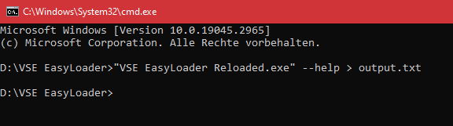
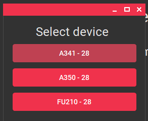

# Erweiterte Funktionen

## :octicons-command-palette-16: Kommandozeilen-Schnittstelle

### Beschreibung
Der VSE EasyLoader 6.0.5 Headless Mode ist ein Kommandozeilenprogramm, das das Hochladen von XML-Dateien auf ein Gerät über eine serielle Schnittstelle erleichtert. Dieses Programm macht eine grafische Benutzeroberfläche überflüssig und ermöglicht die automatische und stapelweise Verarbeitung von Datei-Uploads.



### Verwendung
Um den VSE EasyLoader 6.0.5 Headless Mode zu verwenden, führen Sie das Programm mit den folgenden Kommandozeilenoptionen aus:

``` batch
"VSE EasyLoader Reloaded.exe" [Optionen]
```

### Optionen
Das Programm unterstützt die folgenden Kommandozeilenoptionen:

- `--com <com>`: Gibt den COM-Port an, der für die Kommunikation verwendet werden soll. Der Parameter "<com>" sollte durch die spezifische COM-Anschlussnummer ersetzt werden, z. B. COM23. Diese Option ist für eine erfolgreiche Kommunikation mit dem Gerät erforderlich.

- `--xml <xml>`: Gibt den Pfad zu der XML-Datei an, die die hochzuladenden Daten enthält. Der Parameter "<xml>" sollte durch den Dateipfad ersetzt werden. Für ein erfolgreiches Hochladen ist es notwendig, eine gültige XML-Datei anzugeben.

- `--version`: Zeigt die Versionsinformationen für das Programm an.

- `-?, -h, --help`: Zeigt die Hilfe und Nutzungsinformationen für das Programm an.

### Beispielverwendung
Hier sind einige Beispiele für die Verwendung des VSE EasyLoader 6.0.5 Headless Mode Programms:

**Upload einer XML-Datei auf ein Gerät an COM23:**

``` Batch
"VSE EasyLoader Reloaded.exe" --com COM23 --xml "C:/pfad/zu/datei.xml"
```
Bitte vergewissern Sie sich, dass Sie über die erforderlichen Rechte für den Zugriff auf den angegebenen COM-Port verfügen und dass die XML-Datei korrekt formatiert ist, um einen erfolgreichen Upload zu gewährleisten.

### Abfrage des Ergebnisses / Erfolgsstatus des Programms

Bitte beachten Sie, dass bei Verwendung des VSE EasyLoader 6.0.5 Headless Mode die Ausgabe bzw. das Ergebnis standardmäßig nicht auf der Konsole angezeigt wird. Um die Ausgabe zu erfassen, wird empfohlen, den `>` Operator in der Kommandozeile zu verwenden, um die Ausgabe in eine Textdatei umzuleiten. Zum Beispiel:

``` batch 
"VSE EasyLoader Reloaded.exe" --com COM23 --xml "C:/pfad/zu/datei.xml" > output.txt
```

Durch die Verwendung des Operators ">" und die Angabe eines Dateinamens (im obigen Beispiel "output.txt") können Sie die Ausgabe des Programms in einer Textdatei speichern, um sie später wieder zu verwenden. Wenn Sie die Ausgabe nicht umleiten, funktioniert das Programm weiterhin, aber es wird keine Ausgabe auf der Konsole angezeigt.

#### Beispiel für eine Batch-Datei zum Hochladen mehrerer Dateien auf mehrere Geräte

Diese Beispiel-Batchdatei demonstriert, wie der Prozess des Hochladens mehrerer Dateien auf mehrere Geräte unter Verwendung des VSE EasyLoader 6.0.5 Headless Mode automatisiert werden kann. Indem Sie die Möglichkeiten einer Batch-Datei nutzen, können Sie den Upload-Prozess rationalisieren und vereinfachen und so Zeit und Mühe sparen.

Gehen Sie folgendermaßen vor, um diese Batch-Datei zu verwenden:

1. Öffnen Sie Editor oder ein ähnliches Textverarbeitungsprogramm, um eine neue Datei zu erstellen.

2. Fügen Sie den folgenden Code in den Texteditor ein:

``` batch
@echo off
echo VSE EasyLoader v6.0.5 Batch Upload (3x)
echo:

cd /D "%LOCALAPPDATA%\VSE EasyLoader"
REM === CUSTOMER INFO ===
REM === CHANGE THE COM PORTS AND PARAMETER FILE PATHS IN THE FOLLOWING 3 COMMANDS ===

echo Starting upload of first device...
START /B "" "VSE EasyLoader Reloaded.exe" --com "COM8" --xml "C:\tmp\upload.xml" > ezldr_log1.txt
echo Starting upload of second device...
START /B "" "VSE EasyLoader Reloaded.exe" --com "COM9" --xml "C:\tmp\upload.xml" > ezldr_log2.txt
echo Starting upload of third device...
START /B "" "VSE EasyLoader Reloaded.exe" --com "CO10" --xml "C:\tmp\upload.xml" > ezldr_log3.txt

REM Check process completion
echo Waiting for EasyLoader processes to finish...
:loop
tasklist /fi "imagename eq VSE EasyLoader Reloaded.exe" |find ":" > nul
if errorlevel 1 goto loop

echo Waiting for output logs to finish writing.
:chk
REM Wait for 1 second
timeout /T 1 /NOBREAK > nul

REM Check if all instances have finished
if not exist ezldr_log1.txt goto chk
if not exist ezldr_log2.txt goto chk
if not exist ezldr_log3.txt goto chk

REM Check return codes
set success=true
findstr /C:"Success! :)" ezldr_log1.txt > nul || set success=false 
findstr /C:"Success! :)" ezldr_log2.txt > nul || set success=false
findstr /C:"Success! :)" ezldr_log3.txt > nul || set success=false
 
if %success%==true (
  echo SUCCESS: All uploads successful.
) else (
  echo ERROR: At least one upload failed.
)

REM Clean up output files
del ezldr_log1.txt
del ezldr_log2.txt
del ezldr_log3.txt

REM Keep console window open
echo:
pause
```
2. Aktualisieren Sie die Batch-Datei mit den erforderlichen Informationen:
   - Ändern Sie die Datei mit den 3 Befehlen so, dass sie die COM-Ports der Geräte enthält, auf die Sie Dateien hochladen möchten. Jeder COM-Port sollte in einer eigenen Zeile aufgeführt werden.
   - Geben Sie den Pfad zu den XML-Dateien an, die Sie in die jeweiligen Geräte hochladen möchten.

3. Speichern Sie die Datei an einem Ort Ihrer Wahl. Achten Sie darauf, dass die Dateiendung "*.bat" lautet.

4. Führen Sie die Batch-Datei durch einen Doppelklick aus.

#### Erklärung, was die Batch-Datei macht

Diese Batch-Datei automatisiert den Upload-Prozess für drei Geräte mit VSE EasyLoader v6.0.5. Im Folgenden wird beschrieben, was die Batch-Datei tut:

1. Der Befehl `@echo off` sorgt dafür, dass die in der Batchdatei ausgeführten Befehle nicht in der Konsole geechot werden.

2. Die `echo`-Befehle zeigen Informationen über den Batch-Upload-Prozess an, wie z.B. die Version von VSE EasyLoader, die verwendet wird, und die Anzahl der Geräte, die hochgeladen werden.

3. Der Befehl `cd /D "%LOCALAPPDATA%\VSE EasyLoader"` ändert das aktuelle Verzeichnis zu dem Ort, an dem VSE EasyLoader installiert ist.

4. Die drei `START /B` Befehle leiten den Upload-Prozess für jedes Gerät ein. Jeder Befehl startet das Programm "VSE EasyLoader Reloaded.exe" mit spezifischen Befehlszeilenparametern, einschließlich des COM-Ports und des Pfads zu der hochzuladenden XML-Datei. Die Ausgabeprotokolle für jeden Upload werden in separate Textdateien umgeleitet (`ezldr_log1.txt`, `ezldr_log2.txt`, `ezldr_log3.txt`).

5. Die Batch-Datei wartet dann mit Hilfe einer Schleife und dem Befehl `tasklist` auf die Beendigung aller EasyLoader-Prozesse. Sobald alle Prozesse abgeschlossen sind, fährt die Batch-Datei mit dem nächsten Schritt fort.

6. Die Stapeldatei wartet eine kurze Zeit mit dem Befehl `timeout`, um sicherzustellen, dass die Ausgabeprotokolle fertig geschrieben sind.

7. Sie prüft dann, ob die Ausgabeprotokolle für alle drei Geräte vorhanden sind. Wenn eines der Protokolle fehlt, kehrt sie zum vorherigen Schritt zurück und wartet weiter auf die Erstellung der Protokolle.

8. Die Batch-Datei prüft die Rückgabecodes in den Ausgabeprotokollen, um den Erfolg oder Misserfolg jedes Uploads festzustellen. Wenn eines der Protokolle einen Fehler anzeigt, wird die Variable `Erfolg` auf `false` gesetzt.

9. Basierend auf dem Wert der Variable `success` zeigt die Batch-Datei entweder eine Erfolgsmeldung an, die besagt, dass alle Uploads erfolgreich waren, oder eine Fehlermeldung, die besagt, dass mindestens ein Upload fehlgeschlagen ist.

10. Die Ausgabeprotokolldateien (`ezldr_log1.txt`, `ezldr_log2.txt`, `ezldr_log3.txt`) werden anschließend gelöscht, um die während des Hochladevorgangs erzeugten Dateien zu bereinigen.

11. Schließlich halten die Befehle `echo` und `pause` das Konsolenfenster offen, so dass der Benutzer die Ausgabe ansehen kann, bevor er es schließt.

Bitte beachten Sie, dass Sie zur Verwendung dieser Batch-Datei die COM-Ports und Dateipfade in den drei Upload-Befehlen an Ihre spezifische Konfiguration anpassen müssen.

## :octicons-cloud-offline-16: Offline-Voreinstellungen erstellen {id="creating-offline-presets"}

EasyLoader kann auch verwendet werden, um eine Konfigurationsdatei (`*.easyConf`-Datei) ohne eine Geräteverbindung zu erstellen. 

Dazu müssen Sie zunächst über die Seitenleiste auf den Reiter **Über EasyLoader** gehen. Klicken Sie dann auf das **Einstellungsmenü**, um ein Kontextmenü zu öffnen, in dem Sie die Option `Geräteverbindung für *.easyConf-Erstellung simulieren` auswählen. 


Wählen Sie nun den Gerätetyp aus, für den Sie die Konfiguration erstellen möchten. Die Registerkarte Einfache Konfiguration wechselt dann in das richtige Layout für die gerätespezifischen Einstellungen. 



Sie können nun auf die Registerkarte **Einfache Konfiguration** wechseln und Ihre Voreinstellung erstellen. Verwenden Sie den :material-content-save: Speichern-Schaltfläche am oberen Rand, um Ihre Einstellungen in einer *.easyConf-Datei zu speichern.

